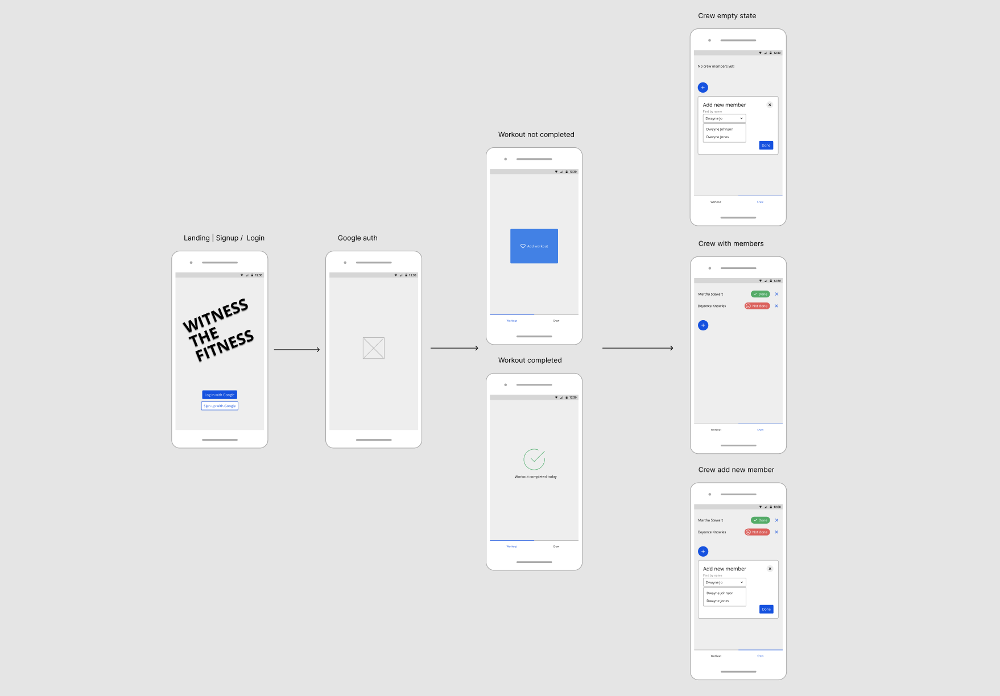

# witness-the-fitness

Small learning project for React Native with Expo and nx
Workout accountability app

## Tasks

- [x] set up nx, expo, and react native client app
- [ ] set up pipeline, deployment and hosting
- [ ] FE routing

#### Signup / login page

- [ ] BE/FE OAuth 2.0 login and signup with Google

#### Workout page

- [ ] BE/FE Get workout status for the day (`workoutCompleted true/false`)
- [ ] BE/FE Add workout for the day (change `workoutCompleted` from `false` to `true`)
- [ ] BE Reset workout status at midnight (cron job)

#### Crew page

- [ ] BE/FE Get user's crew members (`name` and `workoutStatus` for each crewMember in the user's `crewMembers` array)
- [ ] BE/FE Push notify user's crew members when workout is added
- [ ] BE/FE Add crew member (add crew member's userId to user's array of crewMembers, and add user's userId to crew member's array of crewMembers)
- [ ] BE/FE Delete crew member (remove crew member's `userId` from user's array of crewMembers, and remove user's `userId` from crew member's array of crewMembers)

## Front-end lo-fi wireframes

## Run the app locally

Run `nx start witness-client` and scan the qr code in the terminal for your chosen OS
